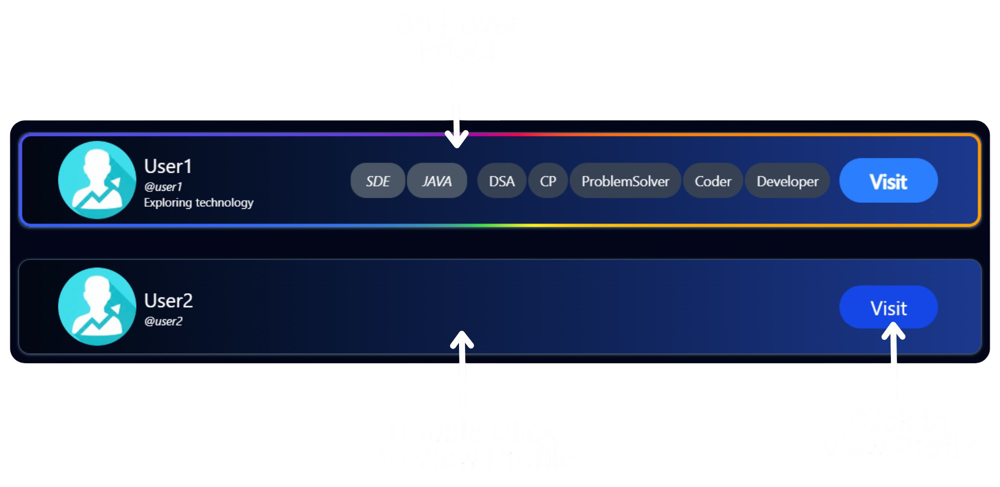
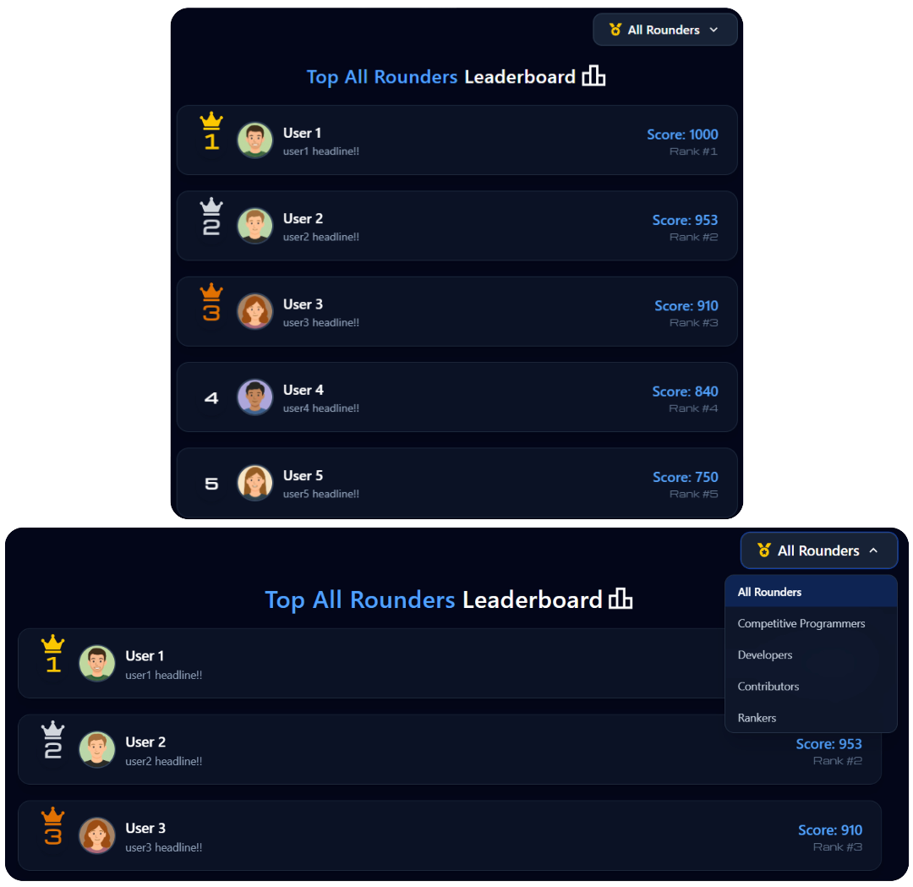

<h1 id="codeelevate-title" align="center" width="100%"><br/></h1>

<h2 width="100%" align="center">S
  
  
  
  
  
  
  
  
  
  
  
  
  
  
  
  
  
  
  
  
  
  
  
  
  
  
  
  
  
  
  
  
  
  
  
  
  <br/>
<a href="./LICENSE"></a>
</h2>

<div id="codeelevate-description">
  <h2><a href="#readme-index">CodeElevate - Elevate Your Coding Journey.</a></h2>
  <h3>CodeElevate is a robust, scalable, and dynamic coder community built to empower competitive programmers, software developers, students, learners, and professionals. The platform provides an all-in-one ecosystem featuring integrated coding and development statistics across multiple platforms, a real-time messaging system, a user connection system, post sharing and engagement, personalized profiles with an advanced profile management system, a community-driven and category-based ranking system, a notification system, search and filter functionality, secure multi-factor authentication (MFA) and authorization mechanisms, including two-factor authentication (2FA) using Time-based One-Time Password (TOTP), an SEO-optimized architecture resulting in top Google search visibility, an MVC architecture for a modular codebase, interactive custom 3D models, and a modern, fully responsive UI/UX design. The goal is to foster growth, collaboration, and innovation among coders worldwide.</h3>
</div>

<div id="codeelevate-live">
  <h2>
    <a href="https://codeelevate-community.vercel.app/" target="_blank" rel="noopener noreferrer">
      <p>CodeElevate </p>
      <p>🌐 Live URL: https://codeelevate-community.vercel.app</p>
    </a>
  </h2>
</div>

<div id="youtube-codeelevate-preview-video">
  <h2>
    <a href="https://www.youtube.com/watch?v=4-Udx0xvsO0" target="_blank" rel="noopener noreferrer">
      <p> CodeElevate Demo / Preview Video</p>
      <p>🎥 Click here to watch full video on YouTube</p>
    </a>
     
  </h2>
</div>

<div id="seo-result">
  <h2>
    <a href="https://www.google.com/search?q=site:codeelevate-community.vercel.app" target="_blank" rel="noopener noreferrer">
      <p>CodeElevate SEO Visibility </p>
      <p>📈 Click here to see the SEO Visibility/Result</p>
    </a>
    <div width="100%">
      <table width="95%" align="center" border="0">
        <tr width="100%">
          <td width="100%" colspan="2" align="center">
            <h5>Production-Grade SEO, Indexing & Web Performance Implementation with Verified <br/>Top Google Search Visibility</h5>
            
          </td>
        </tr>
        <tr width="100%">
          <td width="100%" colspan="2" align="center">
            
          </td>
        </tr>
        <tr width="100%">
          <td width="50%">
            
          </td>
          <td width="50%">
            
          </td>
        </tr>
        <tr width="100%">
          <td width="50%">
            
          </td>
          <td width="50%">
            
          </td>
        </tr>
        <tr width="100%">
          <td width="50%">
            
          </td>
          <td width="50%">
            
          </td>
        </tr>
        <tr width="100%">
          <td width="50%">
            
          </td>
          <td width="50%">
            
          </td>
        </tr>
        <tr width="100%">
          <td width="50%">
            
          </td>
          <td width="50%">
            
          </td>
        </tr>
        <tr width="100%">
          <td width="50%">
            
          </td>
          <td width="50%">
            
          </td>
        </tr>
        <tr width="100%">
          <td width="100%" colspan="2" align="center">
            
          </td>
        </tr>
        <tr width="100%">
          <td width="100%" colspan="2" align="center">
            
          </td>
        </tr>
        <tr width="100%">
          <td width="100%" colspan="2" align="center">
            
          </td>
        </tr>
        <tr width="100%">
          <td width="100%" colspan="2" align="center">
            
          </td>
        </tr>
      </table>
    </div>
  </h2>
</div>

<div id="performance">
  <h2>
    <a href="https://omkarardekar12.github.io/CodeElevate/reports/lighthouse-report/" target="_blank" rel="noopener noreferrer">
      <p> CodeElevate Performance</p>
      <p>📊 Click here to see the Lighthouse Detailed Performance Report</p>
    </a>
    <div width="100%">
      <table width="95%" align="center" border="0">
        <tr width="100%">
          <td width="100%" colspan="2" align="center">
            <h5>Production-Grade, Live-Measured Web Performance & SEO Validation</h5>
            
          </td>
        </tr>
        <tr width="100%">
          <td width="100%" colspan="2" align="center">
            
          </td>
        </tr>
      </table>
    </div>
  </h2>
</div>

---

<div>
  <h2 id="readme-index"><a href="#codeelevate-title">Table of Content 📑</a></h2>
  <h3>
    <ol>
      <li><a href="#codeelevate-description">Description</a></li>
      <li><a href="#codeelevate-live">Live Application</a></li>
      <li><a href="#youtube-codeelevate-preview-video">Demo / Preview Video</a></li>
      <li><a href="#seo-result">SEO Visibility & Indexing</a></li>
      <li><a href="#performance">Live-Measured Web Performance & SEO Validation</a></li>
      <li><a href="#overview">Overview</a></li>
      <li><a href="#features">Features</a></li>
      <li><a href="#technologies-used">Technologies Used / Tech Stack</a></li>
      <li><a href="#system-architecture">System Architecture of CodeElevate</a></li>
      <li><a href="#database-design">CodeElevate Database Design</a></li>
      <li><a href="#folder-file-structure">Folders and Files Structure</a>
      <ul type="disc">
        <li><a href="#overview-folder-file-structure">Overview of Folders and Files Structure</a></li>
        <li><a href="#detail-folder-file-structure">Detailed Folders and Files Structure</a></li>
      </ul>
      </li>
      <li><a href="#environment-variables">Environment Variables Configuration</a></li>
      <li><a href="#installation">Installation</a></li>
      <li><a href="#diagrams">Structure Flow Diagrams, Web Performance & SEO Visibility</a></li>
      <li><a href="#preview">Features Preview</a></li>
      <li><a href="#reports">Audit & Performance Reports</a></li>
      <li><a href="#github-pages">Project Portal</a></li>
      <li><a href="#license">License</a></li>
      <li><a href="#author">Author</a></li>
    </ol>
  </h3>
</div>

---

<div>
  <h2 id="overview"><a href="#readme-index">Overview 🖥️</a></h2>
  <h3>CodeElevate is a MERN stack-based web application that empowers users to showcase their coding and development profiles in one unified platform. It enables learners, competitive programmers, professionals, coders, and developers to analyze, track, and elevate their progress in both competitive programming and software development. Users can compete, connect, and grow together by earning ranks across multiple categories, building meaningful connections, and engaging through posts, connections, and real-time messaging features. At CodeElevate, our goal is to inspire growth, celebrate achievement, and build a community where every coder can rise to their full potential.</h3>
</div>

---

<div>
  <h2 id="features"><a href="#readme-index">Features ✨</a></h2>
  <table border="1">
    <thead>
      <tr>
        <th>S.No.</th>
        <th>Feature</th>
        <th>Description</th>
      </tr>
    </thead>
    <tbody>
      <tr>
        <td>1.</td>
        <td><b>User Authentication & Authorization - Multi-Factor Authentication (MFA) with Two-Factor Authentication (2FA) using TOTP (Time-Based One-Time Password)</b></td>
        <td>Robust and Secure authentication using Passport, Passport-Local-Strategy, Sessions, JWT, and Two-Factor Authentication (2FA) via TOTP and QR code for enhanced account protection.</td>
      </tr>
      <tr>
        <td>2.</td>
        <td><b>User Profile System & User Profile Management System</b></td>
        <td>Comprehensive profiles with editable details, skills, education, social links, user details, coding and development profiles, customizable profile images and banners and show stats feature to control the visibility of CP and Development statistics.</td>
      </tr>
      <tr>
        <td>3.</td>
        <td><b>Competitive Programming and Development Profiles Stats</b></td>
        <td>Users can add their Competitive Programming or Coding profiles (LeetCode, Codeforces, AtCoder, CodeChef, GeeksforGeeks, HackerRank) and development profiles (GitHub, GitLab). After enabling the Stats feature, real-time data from LeetCode, Codeforces, and GitHub APIs are displayed.</td>
      </tr>
      <tr>
        <td>4.</td>
        <td><b>Search & Filter Search Functionality</b></td>
        <td>Smart, responsive search by names, roles, domains, or tags, with advanced filters for Trending, CP, Devs, Experience, and Professionals.</td>
      </tr>
      <tr>
        <td>5.</td>
        <td><b>Real-Time Messaging</b></td>
        <td>Instant one-on-one text and image chat built using Socket.IO and Socket.IO Client, featuring real-time communication, online user detection, responsive UI and smooth UI animations.</td>
      </tr>
      <tr>
        <td>6.</td>
        <td><b>Connection System</b></td>
        <td>Follow, unfollow, connect, disconnect, and message users seamlessly with real-time messaging system, connection status tracking and notifications.</td>
      </tr>
      <tr>
        <td>7.</td>
        <td><b>Ranking System</b></td>
        <td>Dynamic leaderboards across five categories — Competitive Programmers, Developers, Rankers, Contributors, and All-Rounders — using live API data. Rankings automatically updated every 24 hours.</td>
      </tr>
      <tr>
        <td>8.</td>
        <td><b>Post Feature</b></td>
        <td>Create, edit, and delete posts with image uploads to share updates and achievements. Add or delete comments, and like or unlike posts seamlessly.</td>
      </tr>
      <tr>
        <td>9.</td>
        <td><b>Notification System</b></td>
        <td>Notifications for follows, unfollows, likes, and connection requests (including accept or reject responses), with robust management and auto-expiry.</td>
      </tr>
      <tr>
        <td>10.</td>
        <td><b>API (Application Programming Interface) Routes</b></td>
        <td>Modular, secure REST API with layered authentication, authorization, Two-Factor Authentication (2FA), and validation middleware for scalability and maintainability.</td>
      </tr>
      <tr>
        <td>11.</td>
        <td><b>Architecture & Security</b></td>
        <td>Developed using the MERN Stack, Socket.IO, MVC Design Pattern, RESTful APIs and Cloudinary for cloud storage management, with Two-Factor Authentication, Authorization, and Validation layers implemented for Robust Performance and Security.</td>
      </tr>
      <tr>
        <td>12.</td>
        <td><b>Interactive 3D Models, 3D Animations & Real-Time 3D Interactions</b></td>
        <td>An immersive 3D CodeElevate logo showcased on the About page, featuring views from multiple camera angles, fluid animations, and styling variations. Built with dynamic transitions for a captivating visual experience, users can seamlessly rotate the models through intuitive interactive controls.</td>
      </tr>
      <tr>
        <td>13.</td>
        <td><b>Animations & Transitions</b></td>
        <td>Smooth, visually appealing animations and transitions across pages and components using Framer Motion, enhancing interactivity and user engagement throughout the platform.
        </td>
      </tr>
      <tr>
        <td>14.</td>
        <td><b>Responsive UI/UX (User Interface and User Experience)</b></td>
        <td>Modern, mobile-first, fully responsive interface built with React, Tailwind CSS, and Framer Motion, featuring smooth animations and visually rich, accessible experiences across all screen sizes.</td>
      </tr>
    </tbody>
  </table>
</div>

---

<div>
  <h2 id="technologies-used"><a href="#readme-index">Technologies Used 💻🛠️</a></h2>
  <p>


  


%20Tags-blue?style=for-the-badge)


-grey?style=for-the-badge)


  </p>

  <div>
    <table border="1">
      <thead>
        <tr>
          <th>#</th>
          <th>Category</th>
          <th>Technologies / Tools</th>
        </tr>
      </thead>
      <tbody>
        <tr>
          <td>&#10148;</td>
          <td>Frontend</td>
          <td>React.js, Vite, Tailwind CSS, Socket.io Client, Framer Motion, Optimistic UI Updates (State-based Incremental Rendering), Axios, React Router DOM, React Context API (Global Session State Management), Three.js (3D Rendering & Real-Time 3D Interactions), React Hot Toast, React Slick, Slick Carousel, 3D Animations, Smooth & Seamless UI Transitions and Animations, Interactive Custom 3D Logo Components, Performance Optimization, SEO Optimization, Fully Responsive UI/UX, JavaScript, CSS3, HTML5, Lucide React, React Icons, FontAwesome, Google Fonts</td>
        </tr>
        <tr>
          <td>&#10148;</td>
          <td>Backend</td>
          <td>Node.js, Express.js, MongoDB, Mongoose, Socket.io (Real-time Communication), RESTful APIs (Representational State Transfer Application Programming Interface), MVC (Model–View–Controller) Architecture / Design Pattern / Framework, RESTful web-service, Performance Optimization, Passport.js, Passport-Local, Cloudinary, Multer, Multer-Storage-Cloudinary, GraphQL, Joi, CORS (Cross-Origin Resource Sharing), Axios</td>
        </tr>
        <tr>
          <td>&#10148;</td>
          <td>Database</td>
          <td>MongoDB (MongoDB Atlas), Mongoose (Object Document Mapper (ODM) for MongoDB), Cloudinary (Cloud Storage for Media Files)</td>
        </tr>
        <tr>
          <td>&#10148;</td>
          <td>Authentication & Security</td>
          <td>Passport.js, Passport-Local-Strategy, Connect-Mongo (for Session Store), JWT (JSON Web Token), bcrypt.js, Express-Session, Cookie-Parser, Body-Parser, Speakeasy (Two-Factor Authentication (2FA)), QRCode (2FA), Joi Validations</td>
        </tr>
        <tr>
          <td>&#10148;</td>
          <td>Architecture & Design</td>
          <td>MERN Stack Architecture (MongoDB, Express, React, Node), MVC Design Pattern, RESTful API Structure, SessionContext for Global State Management, Real-time Communication using Socket.io, Robust, Modular and Scalable Codebase, Environment Configuration using dotenv, Optimized Folder Structure, Responsive and Component-Based Frontend Design, Client-side State Management with Incremental Update</td>
        </tr>
        <tr>
          <td>&#10148;</td>
          <td>APIs Integrated</td>
          <td>Custom REST APIs (CodeElevate): Authentication, Profiles, Messages, Posts, Rankings, Connections, Notifications, Competitive Programming Stats, Development Stats.<br/>External APIs: LeetCode GraphQL API, Codeforces REST API, GitHub REST API (for Displaying Competitive Programming Profiles / Coding Profiles Statistics and Development Profiles Statistics).</td>
        </tr>
        <tr>
          <td>&#10148;</td>
          <td>SEO (Search Engine Optimization) & Website Optimization</td>
          <td>Google Search Console (for Indexing & Performance Tracking), SEO-friendly Meta Tags (Title, Description, Keywords, Canonical URL, Author, Language), Open Graph (OG) Tags (for Facebook and Linkedin sharing), Twitter Card Meta Tags, Schema.org JSON-LD Structured Data (Organization & Author Info), Robots.txt (for Crawler Directives), Sitemap.xml (for Site Indexing), Manifest.json (for Web App Metadata & Theme Color), Mobile Viewport Meta Tag, Apple Touch Configuration (PWA (Progressive Web Application) readiness), Theme Color for Browser UI, Fast build using Vite, TailwindCSS for Lightweight CSS, Responsive Design for all Devices, Preconnect & Prefetch tags, Optimistic UI Updates, HTTPS-secured URLs (via Vercel & Render)</td>
        </tr>
        <tr>
          <td>&#10148;</td>
          <td>Development Tools & Libraries</td>
          <td>Nodemon, Vite Build, dotenv, Postman, Hoppscotch, Thunder Client, VS Code, Git, GitHub, Google Search Console, Canva (for UI Assets)</td>
        </tr>
        <tr>
          <td>&#10148;</td>
          <td>Deployment & Hosting</td>
          <td>Vercel (Frontend Hosting), Render (Backend Hosting), MongoDB Atlas (Database Hosting), Cloudinary (Cloud Storage), GitHub Pages (Portal Hosting)</td>
        </tr>
      </tbody>
    </table>
  </div>
</div>

---

<div>
  <h2 id="system-architecture"><a href="#readme-index">System Architecture of CodeElevate ⌨️🏗️</a></h2>
  <div width="90%" align="center">
    
  </div>
</div>

---

<div>
  <h2 id="database-design"><a href="#readme-index">CodeElevate Database Design 💾🗃️</a></h2>
  <div width="90%" align="center">
    
  </div>
</div>

---

<div>
  <h2 id="folder-file-structure"><a href="#readme-index">Folders & Files Structure 📂🗄️</a></h2>
  <h3 id="overview-folder-file-structure">Overview of Folders & Files Structure</h3>

```bash
📂 CODEELEVATE
├── 📁 backend
│   ├── 📁 src
│   ├── .env
│   ├── .gitignore
│   ├── package.json
│   ├── package-lock.json
│   └── 📁 node_modules
├── 📁 frontend
│   ├── 📁 src
│   ├── .env
│   ├── .gitignore
│   ├── eslint.config.js
│   ├── index.html
│   ├── package-lock.json
│   ├── package.json
│   ├── vercel.json
│   ├── vite.config.js
│   └── 📁 node_modules
├── 📁 docs
│   └── index.html
├── .gitignore
├── .gitattributes
├── LICENSE
└── README.md
```

<h3 id="detail-folder-file-structure">Detailed Folders & Files Structure</h3>

```bash
📂 CODEELEVATE
├── 📁 backend
│   ├── 📁 src
│   │   ├── 📁 controllers
│   │   │   ├── authController.js
│   │   │   ├── profileController.js
│   │   │   ├── rankingController.js
│   │   │   ├── messageController.js
│   │   │   ├── connectionController.js
│   │   │   ├── postController.js
│   │   │   ├── notificationController.js
│   │   │   ├── competitiveProgrammingStatsController.js
│   │   │   └── developmentProfilesStatsController.js
│   │   ├── 📁 middlewares
│   │   │   ├── auth.js
│   │   │   ├── auth2FA.js
│   │   │   ├── verifyAuth.js
│   │   │   ├── userValidations.js
│   │   │   ├── profileValidations.js
│   │   │   ├── postValidations.js
│   │   │   ├── messageValidations.js
│   │   │   ├── notificationValidations.js
│   │   │   └── errorHandlers.js
│   │   ├── 📁 routes
│   │   │   ├── authRoutes.js
│   │   │   ├── profileRoutes.js
│   │   │   ├── rankingRoutes.js
│   │   │   ├── messageRoutes.js
│   │   │   ├── postRoutes.js
│   │   │   ├── connectionRoutes.js
│   │   │   ├── notificationRoutes.js
│   │   │   ├── competitiveProgrammingStatsRoutes.js
│   │   │   └── developmentProfilesStatsRoutes.js
│   │   ├── 📁 utils
│   │   │   ├── ExpressError.js
│   │   │   └── wrapAsync.js
│   │   ├── 📁 validations
│   │   │   ├── userValidations.js
│   │   │   ├── profileValidations.js
│   │   │   ├── postValidations.js
│   │   │   ├── messageValidations.js
│   │   │   └── notificationValidations.js
│   │   ├── 📁 models
│   │   │   ├── user.js
│   │   │   ├── profile.js
│   │   │   ├── rankingCache.js
│   │   │   ├── post.js
│   │   │   ├── message.js
│   │   │   └── notification.js
│   │   ├── 📁 schemas
│   │   │   ├── userSchema.js
│   │   │   ├── profileSchema.js
│   │   │   ├── rankingCacheSchema.js
│   │   │   ├── postSchema.js
│   │   │   ├── messageSchema.js
│   │   │   └── notificationSchema.js
│   │   ├── 📁 lib
│   │   │   ├── 📁 docs
│   │   │   │   ├── codeElevateArchitecture.png
│   │   │   │   └── mongodbDatabaseStructure.png
│   │   │   ├── 📁 reports
│   │   │   │   ├── 📁 lighthouse-report
│   │   │   │   │   └── index.html
│   │   │   │   ├── lighthouseAuditSummary.png
│   │   │   │   ├── lighthousePerformanceMetrics.png
│   │   │   │   └── LighthouseReport.pdf
│   │   │   ├── 📁 seo
│   │   │   │   ├── crawlStats1.png
│   │   │   │   ├── crawlStats2.png
│   │   │   │   ├── httpReport.png
│   │   │   │   ├── indexedPages1.png
│   │   │   │   ├── indexedPages2.png
│   │   │   │   ├── robotsStats.png
│   │   │   │   ├── seoPerformance1.png
│   │   │   │   ├── seoPerformance1prev.png
│   │   │   │   ├── seoPerformance2.png
│   │   │   │   ├── seoPerformance2prev.png
│   │   │   │   ├── seoResult.png
│   │   │   │   ├── seoSearchResult.png
│   │   │   │   ├── seoSearchUpdated.png
│   │   │   │   ├── seoSearchUpdated1.png
│   │   │   │   ├── seoSearchUpdated2.png
│   │   │   │   ├── seoSitemaps1.png
│   │   │   │   ├── seoSitemaps2.png
│   │   │   │   ├── seoSiteResult.png
│   │   │   │   ├── seoStats.png
│   │   │   │   └── urlInspection.png
│   │   │   └── 📁 diagrams
│   │   │       ├── authenticationDiagram.png
│   │   │       ├── authorizationDiagram.png
│   │   │       ├── profileSystemDiagram.png
│   │   │       ├── rankingSystemDiagram.png
│   │   │       ├── messagingSystemDiagram.png
│   │   │       ├── postSystemDiagram.png
│   │   │       ├── connectionSystemDiagram.png
│   │   │       ├── notificationSystemDiagram.png
│   │   │       ├── cpStatsSystemDiagram.png
│   │   │       └── devsStatsSystemDiagram.png
│   │   ├── 📁 config
│   │   │   ├── cloudConfig.js
│   │   │   ├── dbConnect.js
│   │   │   └── passportConfig.js
│   │   └── index.js
│   ├── .env
│   ├── .gitignore
│   ├── package.json
│   ├── package-lock.json
│   └── 📁 node_modules
│
├── 📁 frontend
│   ├── 📁 src
│   │   ├── 📁 service
│   │   │   ├── api.js
│   │   │   ├── socketService.js
│   │   │   ├── authApi.js
│   │   │   ├── profilesApi.js
│   │   │   ├── rankingsApi.js
│   │   │   ├── messagesApi.js
│   │   │   ├── connectionApi.js
│   │   │   ├── postsApi.js
│   │   │   ├── competitiveProgrammingStatsApi.js
│   │   │   ├── developmentProfilesStatsApi.js
│   │   │   ├── notificationsApi.js
│   │   │   └── 📁 utils
│   │   │       └── getToken2FA.js
│   │   ├── 📁 context
│   │   │   └── SessionContext.jsx
│   │   ├── 📁 assets
│   │   │   ├── CodeElevateLogo.gif
│   │   │   └── CodeElevateLogo.png
│   │   ├── 📁 components
│   │   │   ├── ProtectedRoute.jsx
│   │   │   ├── PrivateRoute.jsx
│   │   │   ├── CodeElevate3DLogo.jsx
│   │   │   ├── Logo3D.jsx
│   │   │   ├── Logo3DGold.jsx
│   │   │   ├── Navbar.jsx
│   │   │   ├── Footer.jsx
│   │   │   ├── LoginForm.jsx
│   │   │   ├── TwoFASetup.jsx
│   │   │   ├── TwoFAVerification.jsx
│   │   │   ├── LeetCodeCardStats.jsx
│   │   │   ├── CodeforcesCardStats.jsx
│   │   │   ├── GitHubCardStats.jsx
│   │   │   ├── Loading.jsx
│   │   │   ├── Loading2.jsx
│   │   │   ├── PostCard.jsx
│   │   │   ├── Comment.jsx
│   │   │   ├── PostsList.jsx
│   │   │   ├── NotFound.jsx
│   │   │   └── Error.jsx
│   │   ├── 📁 pages
│   │   │   ├── HomePage.jsx
│   │   │   ├── LoginPage.jsx
│   │   │   ├── Setup2FA.jsx
│   │   │   └── Verify2FA.jsx
│   │   ├── 📁 home
│   │   │   ├── Home.jsx
│   │   │   ├── Hero.jsx
│   │   │   ├── TopCard.jsx
│   │   │   ├── Profile.jsx
│   │   │   ├── ProfileSection.jsx
│   │   │   ├── SearchSection.jsx
│   │   │   ├── Search.jsx
│   │   │   ├── FilterSection.jsx
│   │   │   └── Filter.jsx
│   │   ├── 📁 profiles
│   │   │   ├── ProfilePage.jsx
│   │   │   ├── EditProfilePage.jsx
│   │   │   ├── UserProfileSection.jsx
│   │   │   ├── ButtonSection.jsx
│   │   │   ├── ProfileSettings.jsx
│   │   │   ├── ConnectionPage.jsx
│   │   │   ├── AboutSection.jsx
│   │   │   ├── CompetitiveProgrammingSection.jsx
│   │   │   ├── DevelopmentSection.jsx
│   │   │   ├── CompetitiveProgrammingStatsSection.jsx
│   │   │   ├── DevelopmentStatsSection.jsx
│   │   │   ├── PostsSection.jsx
│   │   │   ├── DomainRoleSection.jsx
│   │   │   ├── TagsSection.jsx
│   │   │   ├── EducationSection.jsx
│   │   │   └── SocialsSection.jsx
│   │   ├── 📁 messages
│   │   │   ├── 📁 skeletons
│   │   │   │   ├── ChatSkeleton.jsx
│   │   │   │   └── SidebarSkeleton.jsx
│   │   │   ├── MessagePage.jsx
│   │   │   ├── Sidebar.jsx
│   │   │   ├── ChatWindow.jsx
│   │   │   ├── ChatHeader.jsx
│   │   │   ├── MessageBubble.jsx
│   │   │   ├── MessageInput.jsx
│   │   │   └── NoChatSelected.jsx
│   │   ├── 📁 posts
│   │   │   ├── CreatePostPage.jsx
│   │   │   ├── EditPostPage.jsx
│   │   │   ├── PostPage.jsx
│   │   │   ├── PostsList.jsx
│   │   │   ├── PostCard.jsx
│   │   │   └── Comment.jsx
│   │   ├── 📁 rankings
│   │   │   ├── RankingPage.jsx
│   │   │   ├── SelectRank.jsx
│   │   │   ├── Rank.jsx
│   │   │   └── RankingList.jsx
│   │   ├── 📁 notifications
│   │   │   ├── NotificationPage.jsx
│   │   │   ├── ConnectRequestNotification.jsx
│   │   │   └── Notification.jsx
│   │   ├── 📁 about
│   │   │   ├── AboutPage.jsx
│   │   │   ├── Hero.jsx
│   │   │   ├── Features.jsx
│   │   │   ├── AuthenticationFeature.jsx
│   │   │   ├── ProfileSystem.jsx
│   │   │   ├── ProfileOptions.jsx
│   │   │   ├── RankingSystemFeature.jsx
│   │   │   ├── StatsFeature.jsx
│   │   │   ├── PostingFeature.jsx
│   │   │   ├── RealTimeMessagingSystemFeature.jsx
│   │   │   ├── ConnectionSystem.jsx
│   │   │   ├── SearchAndFilterSearchFunctionalityFeature.jsx
│   │   │   ├── NotificationFeature.jsx
│   │   │   ├── UserCentricDesign.jsx
│   │   │   ├── ResponsiveDesignFeature.jsx
│   │   │   ├── ImageSection.jsx
│   │   │   ├── ContentSection.jsx
│   │   │   └── Creator.jsx
│   │   ├── routes.jsx
│   │   ├── main.jsx
│   │   ├── socket.js
│   │   ├── App.jsx
│   │   ├── App.css
│   │   └── index.css
│   ├── 📁 public
│   │   ├── 📁 about
│   │   │   ├── authentication.png
│   │   │   ├── accessibility.png
│   │   │   ├── searchFunctionality.png
│   │   │   ├── profilePreview.png
│   │   │   ├── profileStatsPreview.png
│   │   │   ├── profileOptions.png
│   │   │   ├── rankingSystem.png
│   │   │   ├── rankingFilters.png
│   │   │   ├── statsSystem.png
│   │   │   ├── postFeature.png
│   │   │   ├── postOptions.png
│   │   │   ├── messagingSystem.png
│   │   │   ├── messagingProcess.png
│   │   │   ├── messagingSystemResponsiveness.png
│   │   │   ├── connectionProcess.png
│   │   │   ├── notificationSystem.png
│   │   │   ├── custom3DSilverLogo.png
│   │   │   ├── custom3DGoldLogo.png
│   │   │   ├── responsiveness.png
│   │   │   └── creator.png
│   │   ├── 📁 icons
│   │   │   ├── LogoCodeElevate.png
│   │   │   └── LogoCodeElevate-share.png
│   │   │   └── LogoCodeElevate-192.png
│   │   │   └── LogoCodeElevate-512.png
│   │   │   └── LogoCodeElevate-logo.png
│   │   ├── 📁 images
│   │   │   ├── CodeElevate3DLogo.stl
│   │   │   ├── CodeElevateLogo.png
│   │   │   ├── CodeElevateLogo.gif
│   │   │   ├── LogoCodeElevate.png
│   │   │   ├── CodeElevateText.gif
│   │   │   ├── defaultBgBannerImage.png
│   │   │   ├── defaultUserImage.png
│   │   │   ├── userImage.png
│   │   │   ├── bgBannerImage.png
│   │   │   ├── rank.png
│   │   │   ├── trophy.png
│   │   │   ├── computer.png
│   │   │   ├── laptop.png
│   │   │   ├── laptopTrophy.png
│   │   │   ├── CodeforcesLogo.png
│   │   │   ├── LeetCodeLogo.png
│   │   │   ├── LeetCodeGuardianBadge.png
│   │   │   ├── LeetCodeKnightBadge.png
│   │   │   ├── logo.gif
│   │   │   ├── CodeElevate.gif
│   │   │   ├── CodeElevateLogoGIF.gif
│   │   │   ├── gifLogo.png
│   │   │   ├── logo.png
│   │   │   └──CodeElevate.png
│   │   ├── 📁 videos
│   │   │   └── codeelevateGIF.gif
│   │   ├── favicon.ico
│   │   ├── sitemap.xml
│   │   ├── manifest.json
│   │   └── robots.txt
│   ├── .env
│   ├── .gitignore
│   ├── eslint.config.js
│   ├── index.html
│   ├── package-lock.json
│   ├── package.json
│   ├── vercel.json
│   ├── vite.config.js
│   └── 📁 node_modules
│
├── 📁 docs
│   ├── 📁 assets
│   │   ├── codeelevateGIF.gif
│   │   ├── CodeElevateLogo.gif
│   │   ├── CodeElevateText.gif
│   │   ├── favicon.ico
│   │   └── logo.png
│   ├── 📁 docs
│   │   ├── codeElevateArchitecture.png
│   │   └── mongodbDatabaseStructure.png
│   ├── 📁 reports
│   │   ├── 📁 lighthouse-report
│   │   │   └── index.html
│   │   ├── lighthouseAuditSummary.png
│   │   ├── lighthousePerformanceMetrics.png
│   │   └── LighthouseReport.pdf
│   ├── 📁 seo
│   │   ├── crawlStats1.png
│   │   ├── crawlStats2.png
│   │   ├── httpReport.png
│   │   ├── indexedPages1.png
│   │   ├── indexedPages2.png
│   │   ├── robotsStats.png
│   │   ├── seoPerformance1.png
│   │   ├── seoPerformance1prev.png
│   │   ├── seoPerformance2.png
│   │   ├── seoPerformance2prev.png
│   │   ├── seoResult.png
│   │   ├── seoSearchResult.png
│   │   ├── seoSearchUpdated.png
│   │   ├── seoSearchUpdated1.png
│   │   ├── seoSearchUpdated2.png
│   │   ├── seoSitemaps1.png
│   │   ├── seoSitemaps2.png
│   │   ├── seoSiteResult.png
│   │   ├── seoStats.png
│   │   └── urlInspection.png
│   ├── 📁 diagrams
│   │   ├── authenticationDiagram.png
│   │   ├── authorizationDiagram.png
│   │   ├── profileSystemDiagram.png
│   │   ├── rankingSystemDiagram.png
│   │   ├── messagingSystemDiagram.png
│   │   ├── postSystemDiagram.png
│   │   ├── connectionSystemDiagram.png
│   │   ├── notificationSystemDiagram.png
│   │   ├── cpStatsSystemDiagram.png
│   │   └── devsStatsSystemDiagram.png
│   └── index.html
│
├── .gitignore
├── .gitattributes
│
├── LICENSE
└── README.md
```

</div>

---

<div>
  <h2 id="environment-variables"><a href="#readme-index">Environment Variables Configuration ⚙️</a></h2>
  <div>

To run **CodeElevate** successfully, you must configure the required environment variables for both **backend** and **frontend** parts of the project.

### 1. Backend Configuration

Create a `.env` file inside the **backend** directory:

```bash
cd backend
touch .env
```

`.env`

```bash
NODE_ENV=development  # or 'production' during deployment
PORT=8080 or your_port_number
MONGODB_URL=your_mongodb_connection_string
SESSION_SECRET=your_session_secret_key
JWT_SECRET=your_jwt_secret_key
CLOUD_NAME=your_cloudinary_cloud_name
CLOUD_API_KEY=your_cloudinary_api_key
CLOUD_API_SECRET=your_cloudinary_api_secret
BACKEND_URL=http://localhost:8080 or your_backend_url
FRONTEND_URL=http://localhost:5173 or your_frontend_url
```

### 2. Frontend Configuration

Create a `.env` file inside the **frontend** directory:

```bash
cd frontend
touch .env
```

`.env`

```bash
VITE_BACKEND_URL=http://localhost:8080 or your_backend_url
```

  </div>
</div>

---

<div>
  <h2 id="installation"><a href="#readme-index">Installation 💽📩</a></h2>
  <div>

### 1. Clone the Repository

```bash
git clone https://github.com/OmkarArdekar12/CodeElevate.git
cd CodeElevate
```

### 2. Backend Installation

#### 2.1. Backend Setup

```bash
cd backend
npm install
```

#### 2.2. Run the Backend Server

```bash
npm start
```

<p align="center">or</p>

```bash
node src/index.js
```

### 3. Frontend Installation

#### 3.1. Frontend Setup

```bash
cd frontend
npm install
```

#### 3.2. Run the Frontend Server

```bash
npm start
```

<p align="center">or</p>

```bash
npm run dev
```

### 4. Contribution Guide

#### 4.1. Fork the Repository

- Click the Fork button on the top-right corner of this repository page.

#### 4.2. Clone Your Fork

```bash
git clone https://github.com/<your-username>/CodeElevate.git
cd CodeElevate
```

#### 4.3. Create a New Branch

```bash
git checkout -b feature/your-feature-name
```

#### 4.4. Make Your Changes

- Implement your changes.

#### 4.5. Commit Your Changes

```bash
git add .
git commit -m "Add: description of your change"
```

#### 4.6. Push the Changes

```bash
git push origin feature/your-feature-name
```

#### 4.7. Create a Pull Request (PR)

- Go to your forked repository on GitHub.
- Click “Compare & Pull Request”.
- Provide a clear description of your changes.
- Submit your PR for review.

  </div>
</div>

---

<div>
  <h2 id="diagrams"><a href="#readme-index">Structure Flow Diagrams 📊, Web Performance ⚡, and SEO Visibility 🌐</a></h2>
  <div width="100%">
    <table width="95%" align="center" border="0">
      <tr>
        <td width="45%">
          <h3 align="center">Two Factor Authentication</h3>
          
        </td>
        <td width="45%">
          <h3 align="center">Two Factor Authorization</h3>
          
        </td>
      </tr>
      <tr>
        <td width="45%">
          <h3 align="center">Profile Management System</h3>
          
        </td>
        <td width="45%">
          <h3 align="center">Ranking System</h3>
          
        </td>
      </tr>
      <tr>
        <td width="45%">
          <h3 align="center">Real-time Messaging System</h3>
          
        </td>
        <td width="45%">
          <h3 align="center">Post Management and Engagement System</h3>
          
        </td>
      </tr>
      <tr>
        <td width="45%">
          <h3 align="center">Connection System</h3>
          
        </td>
        <td width="45%">
          <h3 align="center">Notification System</h3>
          
        </td>
      </tr>
      <tr>
        <td width="45%">
          <h3 align="center">Competitive Programming Stats System</h3>
          
        </td>
        <td width="45%">
          <h3 align="center">Development Stats System</h3>
          
        </td>
      </tr>
      <tr>
        <td width="90%" colspan="2" align="center">
          <h3 align="center">Ranked #1 on Google Search with fully indexed routes and strong SEO visibility</h3>
          
        </td>
      </tr>
      <tr>
        <td width="90%" colspan="2" align="center">
          <h3 align="center">SEO Google Search Visibility</h3>
          
        </td>
      </tr>
      <tr>
        <td width="45%">
          <h3 align="center">Google Search Visibility</h3>
          
        </td>
        <td width="45%">
          <h3 align="center">Google Search Visibility with Different Logo Icon</h3>
          
        </td>
      </tr>
      <tr>
        <td width="45%">
          <h3 align="center">SEO Crawl Stats</h3>
          
        </td>
        <td width="45%">
          <h3 align="center">SEO Detailed Crawl Stats</h3>
          
        </td>
      </tr>
      <tr>
        <td width="45%">
          <h3 align="center">SEO Performance</h3>
          
        </td>
        <td width="45%">
          <h3 align="center">SEO Detailed Performance</h3>
          
        </td>
      </tr>
      <tr>
        <td width="45%">
          <h3 align="center">Page indexing</h3>
          
        </td>
        <td width="45%">
          <h3 align="center">Indexed pages</h3>
          
        </td>
      </tr>
      <tr>
        <td width="45%">
          <h3 align="center">HTTPS</h3>
          
        </td>
        <td width="45%">
          <h3 align="center">Browser Search Visibility</h3>
          
        </td>
      </tr>
      <tr>
        <td width="45%">
          <h3 align="center">SEO Sitemaps Success</h3>
          
        </td>
        <td width="45%">
          <h3 align="center">Search Visibility</h3>
          
        </td>
      </tr>
      <tr>
        <td width="90%" colspan="2" align="center">
          <h3 align="center">sitemap.xml Accepted and Successfully Indexed</h3>
          
        </td>
      </tr>
      <tr>
        <td width="90%" colspan="2" align="center">
          <h3 align="center">robots.txt Accepted and Successfully Validated</h3>
          
        </td>
      </tr>
      <tr>
        <td width="90%" colspan="2" align="center">
          <h3 align="center">Lighthouse Audit Summary (Production)</h3>
          
        </td>
      </tr>
      <tr>
        <td width="90%" colspan="2" align="center">
          <h3 align="center">Lighthouse Performance Metrics (Core Web Vitals)</h3>
          
        </td>
      </tr>
      <tr>
        <td width="90%" colspan="2" align="center">
          <h3 align="center">SEO Achievement Stats</h3>
          
        </td>
      </tr>
      <tr>
        <td width="90%" colspan="2" align="center">
          <h3 align="center">URL Inspection</h3>
          
        </td>
      </tr>
    </table>
  </div>
</div>

---

<div>
  <h2 id="preview"><a href="#readme-index">Features Preview 🎨🪟</a></h2>
  <div width="100%" align="center">
    <table width="95%" align="center" border="0">
      <tr>
        <td width="45%">
          <h3 align="center">Two Factor Authentication using TOTP</h3>
          
        </td>
        <td width="45%">
          <h3 align="center">User Centric UI Design & Multi-functionality</h3>
          
        </td>
      </tr>
      <tr>
        <td width="45%">
          <h3 align="center">Search and Filter Search Functionality</h3>
          
        </td>
        <td width="45%">
          <h3 align="center">User Profile Stats</h3>
          
        </td>
      </tr>
      <tr>
        <td width="45%">
          <h3 align="center">User Profile</h3>
          
        </td>
        <td width="45%">
          <h3 align="center">User Profile Options</h3>
          
        </td>
      </tr>
      <tr>
        <td width="45%">
          <h3 align="center">Post Feature</h3>
          
        </td>
        <td width="45%">
          <h3 align="center">Post Options</h3>
          
        </td>
      </tr>
      <tr>
        <td width="45%">
          <h3 align="center">Connection System and Connection Process</h3>
          
        </td>
        <td width="45%">
          <h3 align="center">Messaging System</h3>
          
        </td>
      </tr>
      <tr>
        <td width="45%">
          <h3 align="center">Messaging Process</h3>
          
        </td>
        <td width="45%">
          <h3 align="center">Messaging System Responsiveness</h3>
          
        </td>
      </tr>
      <tr>
        <td width="45%">
          <h3 align="center">Ranking Categories</h3>
          
        </td>
        <td width="45%">
          <h3 align="center">Ranking System</h3>
          
        </td>
      </tr>
      <tr>
        <td width="45%">
          <h3 align="center">Notification System</h3>
          
        </td>
        <td width="45%">
          <h3 align="center">Stats Feature</h3>
          
        </td>
      </tr>
      <tr>
        <td width="45%">
          <h3 align="center">Custom 3D Logo</h3>
          
        </td>
        <td width="45%">
          <h3 align="center">Custom 3D Logo</h3>
          
        </td>
      </tr>
      <tr align="center">
        <td width="90%" colspan="2" align="center">
          <h3 align="center">Responsive UI Design</h3>
          
        </td>
      </tr>
    </table>
  </div>
</div>

---

<div>
  <h2 id="reports"><a href="#readme-index">Audit and Performance Reports 🧾</a></h2>
  <div>

### Verified and production-grade audit reports generated using industry-standard tools to evaluate web performance, accessibility, best practices, and SEO on the live CodeElevate application.

- ### [CodeElevate Application Live Production Level Lighthouse Performance Report](https://omkarardekar12.github.io/CodeElevate/reports/lighthouse-report/)

- ### [Lighthouse Performance Report (PDF)](https://omkarardekar12.github.io/CodeElevate/reports/LighthouseReport.pdf)

  </div>
</div>

---

<div>
  <h2 id="github-pages"><a href="#readme-index">Project Portal 📘</a></h2>
  <div>

### Publicly hosted documentation and reports for CodeElevate, served via GitHub Pages. This portal consolidates performance audits, SEO validation, and system documentation in a single, accessible location.

- ### [CodeElevate Project Portal](https://omkarardekar12.github.io/CodeElevate/)

  </div>
</div>

---

<div>
  <h2 id="license"><a href="#readme-index">License 📄</a></h2>
  <div>

### This project is licensed under the terms of the **_MIT License_**.

### See the [LICENSE](./LICENSE) file for more information.

  </div>
</div>

---

<div>
  <h2 id="author"><a href="#readme-index">Author 👨‍💻</a></h2>
  <div>
  
### Omkar Ardekar 💻

[](https://www.linkedin.com/in/omkarardekar09)
[](https://github.com/OmkarArdekar12)

  </div>
</div>

<br/>
<hr/>
<hr/>

<!-- <h1 id="codeelevate-title"></h1>
<div>
  
  
  
  
  
  
  
  
  
  
  
  
  
  
  
  
  
  
  
  
  
  
  
  
  
  
  
  <br/>
  <a href="./LICENSE"></a>
</div> -->
